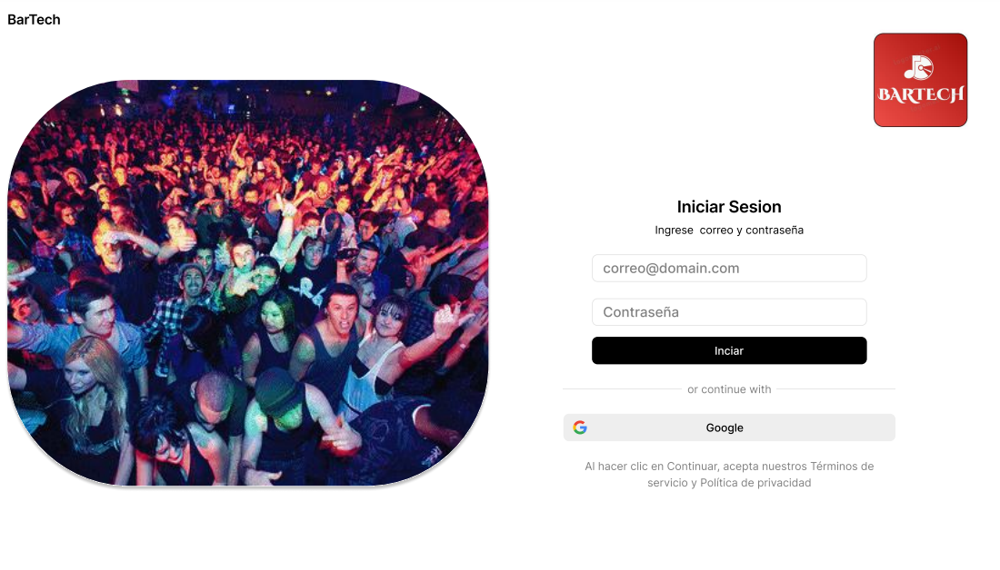

# T&iacute;tulo (IGNORADO)

Se hizo un análisis del negocio antes de la propuesta de este software, el cual se describe en el siguiente diagrama de secuencia:

## Diagrama de secuencia antes del software


Posteriormente se hizo otro análisis de cómo funcionará el negocio una vez implementado el software:

## Diagrama de secuencia después del software


## Arquitectura C4

Para la arquitectura del sistema se optó por utilizar el modelo C4 la cual es una técnica para visualizar la arquitectura de software en diferentes niveles de abstracción.

## Diagrama de contexto

Primeramente se muestra el diagrama de contexto el cual muestra una vista de alto nivel del sistema y su entorno:


Se puede observar que la aplicación web es utilizada por 2 tipos de usuarios (Administrador y usuario general). Por otra parte se relaciona con una aplicación externa (Youtube).

## Diagrama de contenedores

Luego se realizó el diagrama de contenedores el cual se enfoca en las aplicaciones, servicios y bases de datos que componen el sistema, en el cual se observa que se puede utilizar en distintos dispositivos:


## Diagrama Componentes de servicios

Con esto se puede detallar el diseño de cada uno de los contenedores.

En el contenedor de servicios se puede observar la arquitectura relacionada al backend:


En este diagrama se puede observar la división de los componentes del backend, siguiendo el patrón de arquitectura de [Microservicios](https://www.atlassian.com/es/microservices/microservices-architecture). 
En el diseño se tiene un componente llamado gateway el cual redirecciona las peticiones a los respectivos componentes, además filtrando las peticiones con ayuda del componente de autenticación, el cual verifica si las peticiones están autenticadas añadiendo una capa de seguridad.

Por otra parte, tenemos los componentes de usuarios, bares y canciones los cuales tienen la lógica para manejar la información relacionada a cada una de dichas entidades.

## Diagrama Componentes web

En el contenedor aplicación web se puede observar la arquitectura relacionada al frontend.


Se puede observar que debido a que el framework seleccionado para la creación del frontend fue Angular, se realizó el diseño dividido por componentes, lo que ayuda a que el código sea modularizado, extensible y fácil de entender.


## Diagrama Base de datos

En cuanto a la base de datos, se utilizaron 3 entidades las cuales son usuarios, bares y canciones, los cuales se relacionan entre sí como se muestra en el diagrama mediante relaciones de uno a muchos, ya que un usuario podrá tener varios bares y a su vez cada bar puede tener varias canciones en la playlist.


## Diagramas de despliegue


La planeación de la fase de despliegue es esencial, ya que permite visualizar cómo sería el paso a un ambiente productivo, y modelar cómo interactúan cada uno de los componentes y sus configuraciones. En cuanto a la aplicación web y los servicios, es decir el frontend y el backend, se van a desplegar de forma local en un servidor de aplicaciones Tomcat, por otra parte la base de datos relacional se va a trabajar en PostgreSQL con un despliegue local.


Además se tiene planeado para una futura implementación realizar el despliegue productivo en la nube, utilizando los servicios de Amazon Web Services.


## Mockups

En esta sección de mockup se encontrará una representación visual estática del producto o diseño de software que permite visualizar su apariencia final antes de ser implementado. Se utiliza ampliamente en diseño web, aplicaciones móviles, y otros productos digitales gracias a la ayuda del responsive design  para comunicar ideas y recibir retroalimentación temprana.Cabe resaltar que los mockups no solo ayudan a mostrar cómo se verá el producto, sino también a identificar posibles mejoras en la interfaz y experiencia de usuario antes del desarrollo.





## Instalación local

Requisitos:

- Docker instalado
- node version 18.9.1
- Git

Para instalar el backend del proyecto se debe primero clonar el repositorio.

```
git clone https://github.com/MDEVGitH/bartech.git backend
cd backend
```

Luego se debe ejecutar el código de docker composer para descargar las imagenes y levantar los contenedores.

```
docker-compose up
```

En cuanto al frontend se debe clonar el repositorio.

```
git clone https://github.com/MDEVGitH/bartech.git frontend
cd frontend
```
Y ejecutar el comando de angular para ejecutar el proyecto.

```
npm install -g @angular/cli
ng serve
```